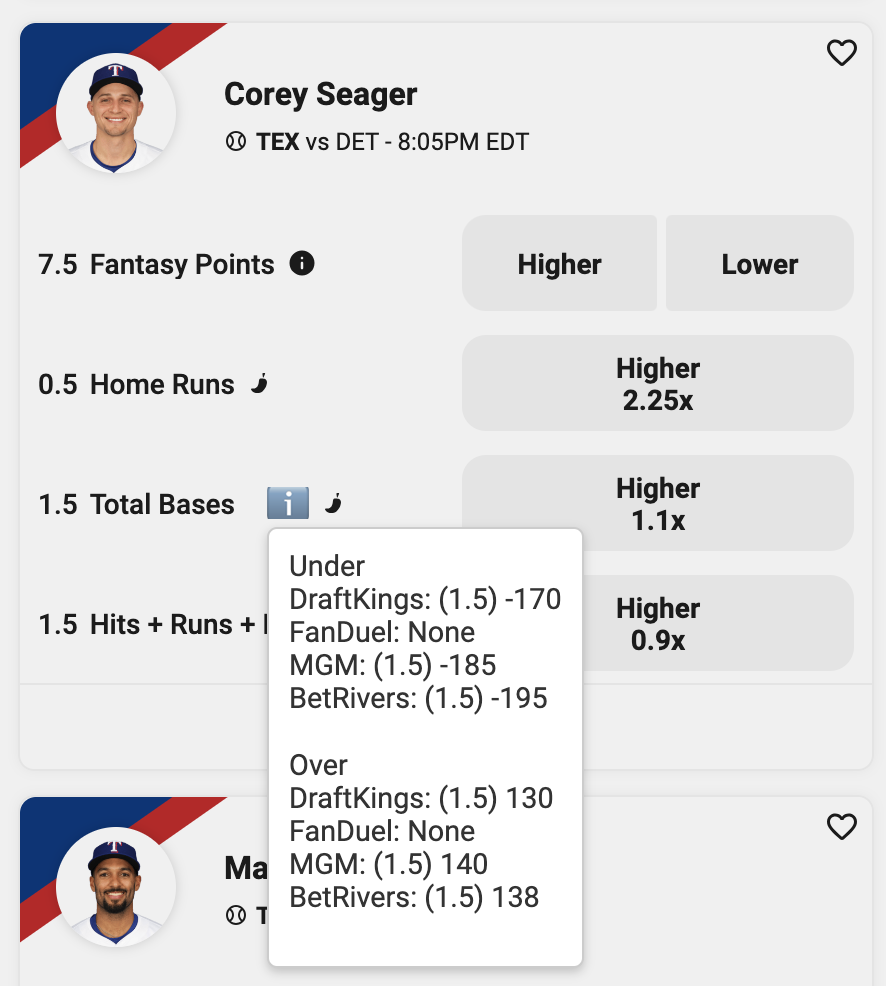

# DFS Odds Comparison Extension

## Overview

The DFS Odds Comparison Extension is a powerful tool designed to enhance your Daily Fantasy Sports (DFS) experience by providing real-time odds comparisons from various sportsbooks. This extension seamlessly integrates into popular DFS platforms, enabling users to make informed decisions by comparing odds for player props directly within the DFS interface. 

## Features

- **Real-time Odds Comparison:** Instantly compare odds from multiple sportsbooks for player props (Total Bases, Runs, and Strikeouts), ensuring you get the best value for your bets.
- **User-Friendly Interface:** The extension adds a simple and intuitive icon next to each player prop. Hovering over the icon reveals detailed odds information in a tooltip.
- **Cross-Platform Compatibility:** Supports integration with both Underdog Fantasy and PrizePicks, providing a versatile tool for DFS enthusiasts.
- **Automated Updates:** The extension automatically updates odds data every few minutes, ensuring you always have the most current information.

## How It Works

Once the extension is installed and activated, it adds an informational icon next to each player prop listed on the DFS platform. Users can hover over the icon to view a detailed breakdown of the odds from different sportsbooks. This breakdown includes odds for various betting options like "Higher" and "Lower," allowing users to quickly compare and make informed decisions.

### Screenshots

## Technology Stack

- **JavaScript:** For manipulating the DOM and injecting the odds data into the DFS platform.
- **CSS:** For styling the odds comparison tooltips and icons.
- **Selenium:** For automating the retrieval of odds data from various sportsbooks.
- **Undetected Chromedriver:** Ensures the script runs without being blocked by security measures.

## Use Case

The DFS Odds Comparison Extension is particularly useful for DFS players who want to maximize their chances of winning by making data-driven decisions. By having access to the latest odds from multiple sources, users can identify the best value bets and adjust their DFS lineups accordingly.

## Contributions

Contributions are welcome! If you have any suggestions, feature requests, or bug reports, please create an issue or submit a pull request on the GitHub repository.

---

This extension aims to bridge the gap between DFS platforms and real-time sports betting data, empowering users with the information they need to succeed in their DFS endeavors. Enjoy a more informed and strategic DFS experience with the DFS Odds Comparison Extension!
